# <b> Module-11-Challenge </b>

## <b> Forecasting Net Prophet </b>

## --------

## Overview

The objective of this Google Colab program is to perform a financial analysis on e-commerce company MercadoLibre. The purpose of the main body of the program is in fact to see if predictions in search traffic can be found, and if so, be a proxy to successfully trade the underlying stock.

## Features

The main tasks outlined in this project will include:

1.) Step 1: Installing and importing the required libraries and dependencies including Pystan, (Facebook) Prophet, hvPlot, Holoviews, datetime, and Matplotlib.  
 
1b.) Step 1b: Finding patterns in the hourly Google Search traffic that may be of use. Essentially, one of the main sub-tasks of the program is to see if Google Search traffic has any link/correlation to financial events at the company. Or, alternatively, is the search traffic data just representative of random noise. The data here is first read from a locally sourced file and put into a Panda's DataFrame. Afterwards, the data is then sliced and analyzed for the month of May 2020 (coinciding with the release of MercadoLibre's quarterly financial results). HvPlots is utilized to visually represent the results. The data set is also used to calculate the total search traffic for the month and then compared to the monthly median across all months. (See Figure 1 & 2)
 
 
2.) Step 2: Next, hourly search traffic data was isolated and analyzed, per marketing department instructions. The goal was to predict interest in the company & platform at any time of day. The theory being, that they can more efficiently advertise and get a higher ROI from their marketing budget deficit if they can pinpoint the optimal advertising windows. This is achieved by grouping the hourly search data and plotting the average traffic by the day of the week. This was done by compartmentalizing search traffic volume into indexed 'hours' [index.hour] and indexed 'days of the week' [index.dayofweek] as separate variable lists. Using hvPlot, they were plotted against one another in order to form a heatmap that compared search traffic during each day of the week as a function of hours of the day. Additionally, search traffic trends were found to be in an increasing uptrend through the last quarter of the year prior to Christmas, accompanied with a sharp drop afterwards. Lulls in traffic volume appear to occur right after Christmas, and during week 34 of the year. (See Figure 3, 4 & 5)
 
 
3.) Step 3: Afterwards, the relationship between search data volume and the company's stock price is analyzed to check for correlation. Stock price data, once again, is read in using panda's read_csv and the stock price data is plotted (See Figure 6). The stock price data and search data (dataframe for Google Trends created earlier) is then concatenated to a single dataframe. The time series indexing of this dataframe was then sliced between 2020-01 and 2020-06 (in order to analyze the first half of the year during and after the initial onslaught of the COVID-19 pandemic to see how e-commerce companies adapted & responded to the evolving market environment). This is then again plotted as a visual comparison chart (See Figure 7). A new column in the dataframe called 'Lagged Search Trends' that offsets search traffic by one hour is added. Ontop of this, an additional two columns of data are added to the dataframe to capture 'Stock Volatility' and 'Hourly Stock Return' (percentage of change in the company stock price on an hourly basis). (See Figure 8)
 
 
4.) Step 4: A time series model that analyzes & forecasts patterns in the hourly search data is then created. A Prophet model is first instantiated with the Google Search data set to said model. Estimations/predictions are made with the model framework & the forecast is then plotted in order to predict the near-term popularity of MercadoLibre. (See Figure 9). Individual time series components of the model are also produced for analysis. (See Figure 10)
 
 
5.) Step 5: The next portion of the program involves assisting the finance group with forecasting the total sales for the next quarter in order to give some guidance in terms of budget planning and to guide expectations for company investors. Here, historical sales revenue (in millions USD) is read in as a dataframe and then applied to another instantiated Prophet model in order to forecast future probable trends. (See Figure 11 & 12)
 
 

## Data Analysis Results and Observations

### <u>MercadoLibre - Google Search Trend Data for the Month of May 2020</u>

 

    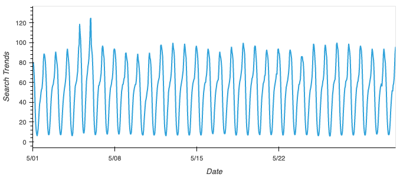

<i>Figure 1. MercadoLibre Google Search Trend data for the month of May 2020.</i>

 

### <u>MercadoLibre - Monthly Median Search Traffic Across All Months</u>

 

    

<i>Figure 2. The monthly median search traffic across all months is calculated by creating a dataframe whereby group indexing using the mean monthly values is calculated view pandas. Here, we can see that the search traffic did in fact increase during the month that MercadoLibre released its financial results - and appears to have in fact broken the decreasing trend of the past 3 years (leading up to and after May, 2020).</i>

 

### <u>MercadoLibre - Average Traffic By Day of the Week</u>

 

    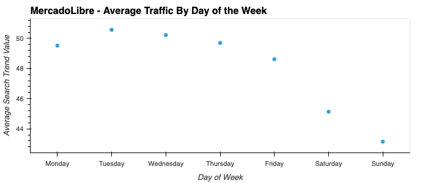

<i>Figure 3. MercadoLibre search traffic displaying maximum search traffic volume during Tuesday's [*actually normalized to Monday's - see argument outlined below], followed by Wednesday in a decreasing trend as the week progresses.</i>

 

### <u>MercadoLibre - Hour of Day vs Day of the Week Search Traffic Volume</u>

 

    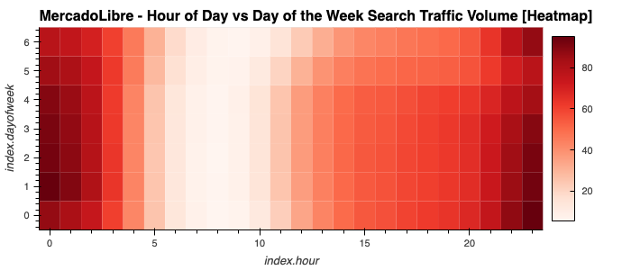

<i>Figure 4. Hour of the day vs day of the week search traffic volume appears to indicate that Monday/Tuesday around 23:00hr-01:00hr are the busiest. However, when taking into consideration & converting the Seattle, WA based nominal UTC timestamp, this translates to an hourly shift around 9pm local Uruguay, Montevideo time (9pm local GMT-3 time, Monday). This makes more sense as customers/consumers are more likely to be shopping in the later hours of the evening on Monday, followed by Tuesday night. See below for a more detailed explanation on the local time shift rationale.</i>

 

### <u>MercadoLibre - Average Search Traffic By Week of the Year</u>

 

    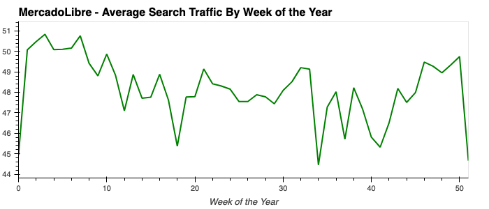

<i>Figure 5. The MercadoLibre hourly search traffic was then grouped by mean search traffic data for each week of the year using 'group_weekofyear' function & plotted, accordingly.</i>

 
 

 

### <u>MercadoLibre - Hourly Closing Stock Price</u>

 

    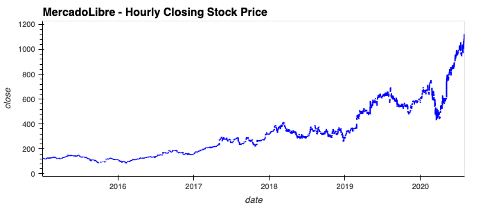

<i>Figure 6. MercadoLibre hourly stock close price plotted over time.</i>

 
 

### <u>MercadoLibre - Hourly Closing Stock Price & Hourly Search Trend Concatenated</u>

 

    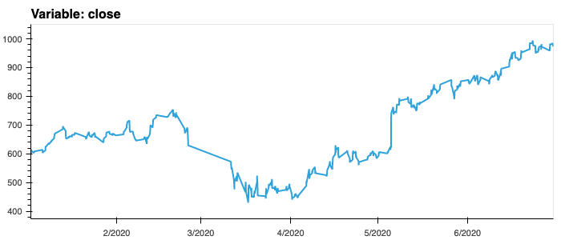

    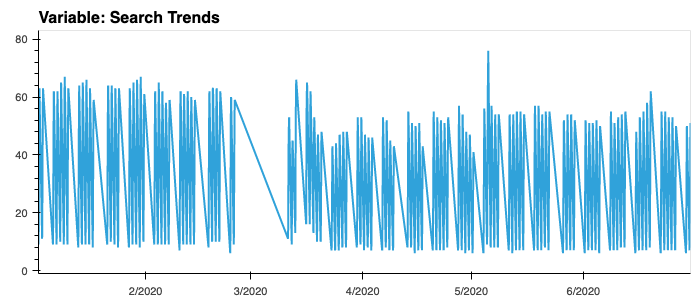

<i>Figure 7. MercadoLibre data for the first half of 2020 (from 2020-01 to 2020-06). Here, the hourly closing stock price and hourly search trend data is concatenated into two subplots for visual comparison of potential correlation.</i>

 
 

### <u>MercadoLibre - Correlation Between Lagged Search Trends, Stock Volatility, & Hourly Stock Returns</u>

 

    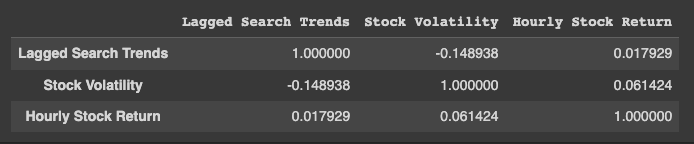

<i>Figure 8. MercadoLibre table displaying relative correlation between stock volatility, lagged search trends, and hourly stock returns. Appears to be weak but present correlation between the hourly stock volatility & hourly stock returns. </i>

 
 

### <u>MercadoLibre - Prophet Forecasted Search Trend Approximation for 2000 hrs out into the Future</u>

 

    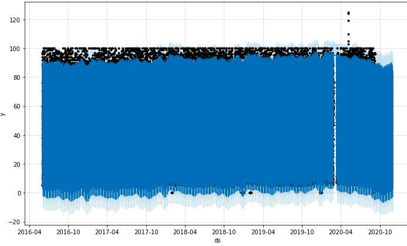

<i>Figure 9. MercadoLibre chart displaying Prophet forecasted search trend approximation. </i>

 
 

### <u>MercadoLibre - Plot Components Utilized to Visualize the Forecast Results</u>

 

    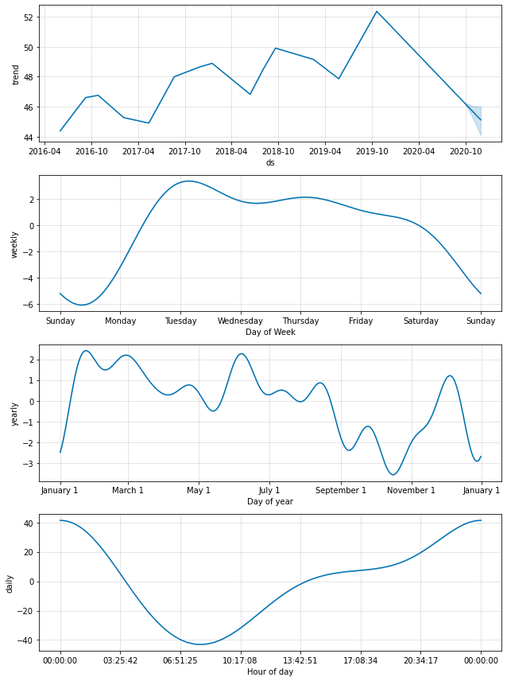

<i>Figure 10. MercadoLibre plot components charts displaying overall search trend data, day of week trends, day of year and hour of day trends. Note, the time of the day that exhibits the greatest popularity is 00:00:00. Now, if this timestamp is calibrated to the base UTC time, it would equate to approximately 17:00:00 (5pm GMT-7, Seattle) time. The reason I equate it to Seattle time is because a search of Mercadolibre's central server location results in a server IP located in Seattle, WA, USA (AWS Server (Amazon-CF Network). Converting this to local Montevideo, Uruguay time this then becomes 21:00:00 (9pm local GMT-3 time) Montevideo time. This makes more rationale sense, as most MercadoLibre's residences in an around latin America would shop between the longitudinal time zones of South America (between UTC/GMT-5 to UTC/GMT-3 (arguably UTC-2)). </i>

 
 

### <u>MercadoLibre - Sales Revenue (Historical) </u>

 

    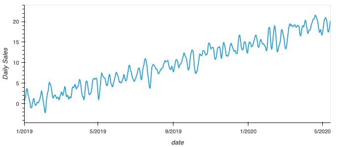

<i>Figure 11. Historical sales data for MercadoLibre (in millions USD).</i>

 
 

### <u>MercadoLibre - Possible Future Sales Projections Using Prophet Modeling </u>

 

    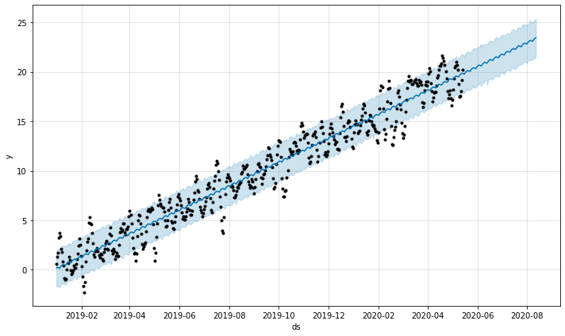

    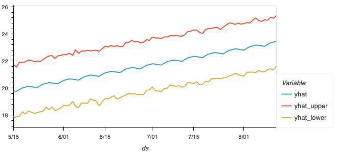

<i>Figure 12. Predictions for probable upcoming future sales revenue for MercadoLibre using the Prophet model prediction toolkit (in millions USD) Based on the forecast information generated above, the sales revenue forecast for the following quarter is expected to be 969.61M (USD) with a worst case scenario of 887.91M (USD), and a best-case top forecast revenue of 1,050.94M (USD).</i>

 
 

## Accompanying File(s)

\*Note: Refer to the google_hourly_search_trends.csv, mercado_daily_revenue.csv, and mercado_stock_price.csv files located within the applicable Resources folder for raw .csv data.

## Running the Project

Running the project can be accomplished by accessing the https://github.com/KristopherGit/Module-11-Challenge.git Git Repository and running each section sequentially.

## Dependencies

No other outside resources are required to run the project except a python engine / python program and the following imported libraries and modules:

(Running in Google Colab Notebook):
!pip install pystan
!pip install prophet
!pip install hvplot --upgrade
!pip install holoviews
!pip install matplotlib --upgrade

import pandas as pd
import holoviews as hv
from prophet import Prophet
import hvplot.pandas
import datetime as dt
%matplotlib inline

from pandas.io.formats.style import Axis
import matplotlib.dates as md
import matplotlib.pyplot as plt
import matplotlib.ticker as mticker
from matplotlib.dates import DateFormatter
import matplotlib.dates as mdates

## Contributors

C Ringwood
